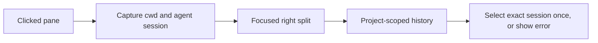

# Agent history beside a pane

Right-click a Herdr pane and choose **Open agent history beside**. The action
captures that pane's foreground directory and structured agent session before
opening a focused right split. History retains its usual cwd-based project
scope and selects the originating session once, without following later focus.



## Install

Requires Python 3 and an `agent-history` executable supporting
`--select-session AGENT:KIND:VALUE`. The launcher also searches `~/util`,
`~/.local/bin`, and `~/.cargo/bin` for installations not in Herdr's inherited PATH.

```sh
make -C ~/agent-history build
herdr plugin link ~/.vim/herdr-plugins/agent-history
```

The normal `make bootstrap-herdr` links this plugin after it is tracked.
The action is also available as `local.agent-history.open` in the action picker.

The action uses the **clicked pane**, not whichever pane becomes focused after
the split. Session identity is passed as a literal process argument, never typed
into the source shell. Missing recognition passes an explicit empty selector;
invalid or unmatched identities produce a visible error in history instead of
silently ignoring the request. Active project/query/tag filters are not removed.
Errors creating the split appear as a Herdr notification and in the plugin log.

Relationship indication is independent; this action does not publish markers,
change agent lifecycle state, or enable history's follow-Herdr mode.

## Test

```sh
python3 ~/.vim/test-herdr-open-history.py
```

The tests use executable stubs and do not modify live Herdr panes.
