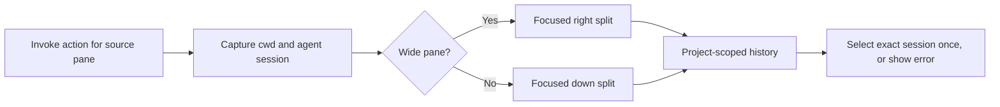

# Agent history beside a pane

The **Open agent history beside** plugin action captures the originating
pane's foreground directory, structured agent session, and layout before
opening a focused split. Wide panes split **right**; tall/narrow panes split
**down**. The shape comparison treats terminal cells as approximately twice
as tall as they are wide (`columns >= 2 × rows` splits right, including ties).
For a zoomed source pane, it uses the visible area rather than its hidden tiled
rectangle. History retains its usual cwd-based project scope and selects the
originating session once, without following later focus.

**Herdr 0.9.3 limitation:** its client-side right-click menu contains only
built-in actions; it does not render registered plugin actions, despite the
manifest's `contexts = ["pane"]`. Reloading config or reattaching does not
make this action appear there. Use **Ctrl+S, then A** with the tracked config,
or the CLI, until Herdr's client menu supports plugin actions.



## Install

Requires Python 3 and an `agent-history` executable supporting
`--select-session AGENT:KIND:VALUE`. The launcher also searches `~/util`,
`~/.local/bin`, and `~/.cargo/bin` for installations not in Herdr's inherited PATH.

```sh
make -C ~/agent-history build
herdr plugin link ~/.vim/herdr-plugins/agent-history
```

The normal `make bootstrap-herdr` links this plugin. With the tracked config,
focus the source pane and press **Ctrl+S, then A**; the keybinding helper labels
it **Open agent history beside**. Run `herdr server reload-config` after updating
an already-running server's config.

Alternatively, invoke the action from an external terminal while the desired
source pane is focused in Herdr:

```sh
herdr plugin action invoke local.agent-history.open
```

The action uses the **pane captured in its invocation context**, not whichever
pane becomes focused after the split. Session identity is passed as a literal process argument, never typed
into the source shell. Missing recognition passes an explicit empty selector;
invalid or unmatched identities produce a visible error in history instead of
silently ignoring the request. Active project/query/tag filters are not removed.
Errors creating the split appear as a Herdr notification and in the plugin log.

Relationship indication is independent; this action does not publish markers,
change agent lifecycle state, or enable history's follow-Herdr mode.

## Test

```sh
python3 ~/.vim/test-herdr-open-history.py
```

The tests use executable stubs and do not modify live Herdr panes.
