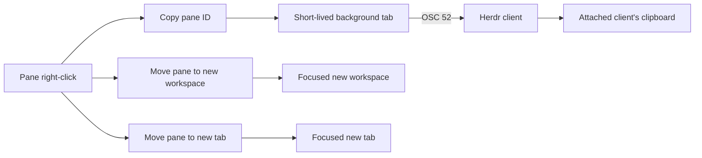

# Herdr Local Pane Actions

Adds **Copy pane ID**, **Move pane to new workspace**, and **Move pane to new tab** to Herdr's pane right-click menu. The selected pane's public ID, such as `w7:p4`, is copied through OSC 52, while the move actions pull the pane out of its current tab into a new focused workspace or tab.



The background tab is necessary for **Copy pane ID** because Herdr captures ordinary plugin-action stdout in its logs. Terminal output from a plugin pane goes through Herdr's clipboard forwarding. That tab does not take focus and exits immediately. **Move pane to new workspace** and **Move pane to new tab** directly move the selected pane into a new focused workspace or tab.

## Install

Bootstrap the tracked Herdr config and all local plugins on each machine running a Herdr server:

```bash
make -C ~/.vim bootstrap-herdr
```

Then right-click a pane and select **Copy pane ID**, **Move pane to new workspace**, or **Move pane to new tab**.

Herdr does not watch plugin manifests. Rerun the bootstrap after adding or changing a tracked `herdr-plugin.toml`; it discovers every tracked plugin manifest. Changes to linked script files apply on the next invocation because the registry still points at the checkout. `herdr server reload-config` reloads `config.toml`, not plugins.

The plugin uses POSIX `sh` and `base64` on macOS/Linux and Windows PowerShell on Windows. Because Herdr carries terminal clipboard events to the attached client, copying also works when viewing a server over SSH. Link the plugin separately on every machine whose Herdr server should expose the action.

## Test

From the repository root:

```bash
./test-herdr-copy-pane-id-plugin.sh
```
