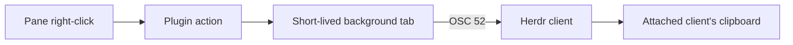

# Herdr Copy Pane ID

Adds **Copy pane ID** to Herdr's pane right-click menu. The selected pane's public ID, such as `w7:p4`, is copied through OSC 52 rather than an OS-specific clipboard command.



The background tab is necessary because Herdr captures ordinary plugin-action stdout in its logs. Terminal output from a plugin pane goes through Herdr's clipboard forwarding. The tab does not take focus and exits immediately.

## Install

Link the plugin on each machine running a Herdr server:

```bash
herdr plugin link ~/.vim/herdr-plugins/copy-pane-id
```

Then right-click a pane and select **Copy pane ID**.

Herdr does not watch plugin manifests. Run `make install-herdr-plugins` from `~/.vim` when registering a new local plugin and rerun it after changing `herdr-plugin.toml`. Changes to linked script files apply on the next invocation because the registry still points at the checkout. `herdr server reload-config` reloads `config.toml`, not plugins.

The plugin uses POSIX `sh` and `base64` on macOS/Linux and Windows PowerShell on Windows. Because Herdr carries terminal clipboard events to the attached client, copying also works when viewing a server over SSH. Link the plugin separately on every machine whose Herdr server should expose the action.

## Test

From the repository root:

```bash
./test-herdr-copy-pane-id-plugin.sh
```
