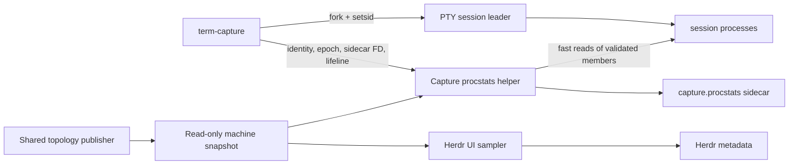

# Capture-owned process statistics

Status: design notebook; no production format or IPC contract is fixed yet.

This plan lives with `pane-load` while its Rust/libproc implementation is the
source of the process sampling logic. The eventual capture integration also
changes termplex.

## Goal

Record CPU, RSS, identity, and topology for the processes executing in one
captured PTY session, on macOS and Linux, without putting metric work in the
terminal-byte path. Every recorded metric must be attributable to that capture;
incomplete observation is acceptable, ambiguous attribution is not.

## Decisions so far

- A capture-owned Rust helper writes the durable process-stat sidecar. The
  existing Herdr-wide sampler remains independent UI infrastructure initially.
- The PTY child is a POSIX session leader. A process belongs to a capture when
  its observed SID equals that root PID. PPID reconstructs display topology but
  is not the ownership boundary.
- Every process identity is `(pid, process_start)`. PID alone is never enough.
- A process that calls `setsid()` intentionally leaves the captured session.
- The helper and terminal recorder share one explicit `clock_gettime` clock and
  zero. Do not correlate C++ `steady_clock` with Rust `Instant`.
- Raw cumulative CPU counters are stored. Percentages, bars, and aggregates are
  derived presentation.
- Polling is authoritative for observed samples, not exhaustive for processes
  that live entirely between observations.
- The monolithic/`--legacy` capture path should be removed before integration;
  process telemetry targets framed TCAP only.

## Ownership and data flow

The shared topology snapshot is a discovery optimization, not a provenance
authority. A capture helper must re-read and validate process start identity and
SID around metric collection before writing a sample.

## Three cadences

1. **Metric sampling: 200–300 ms**
   - Visit only members already known to this capture.
   - Validate start identity and SID.
   - Read cumulative CPU and current RSS.
   - Remove exited, reused, unreadable, or detached identities as appropriate.

2. **Targeted topology expansion: event-driven or short polling**
   - macOS: register `EVFILT_PROC` hints for known members. `NOTE_FORK` does not
     include the child PID on macOS, so follow it with recursive
     `proc_listchildpids()` calls. `NOTE_EXEC` and `NOTE_EXIT` can refresh or
     remove known entries.
   - Linux baseline: recursively read `/proc/<pid>/task/<tid>/children` for all
     threads of known members. Proc connector events may be an optional
     accelerator when available and permitted; eBPF and ptrace are not baseline
     dependencies.
   - Validate every discovered child against the capture SID before adoption.

3. **Full SID reconciliation: slow fallback**
   - Reconcile against a shared whole-machine topology generation, tentatively
     every 20 seconds per consumer.
   - The publisher refreshes that machine snapshot often enough that its stated
     age is no more than roughly 5 seconds.
   - Targeted expansion handles ordinary launch latency; reconciliation repairs
     notification loss, reparenting races, and children missed before their
     parent disappeared.

The proposed 5-second snapshot publication and 20-second consumer reconciliation
are starting values to benchmark, not format guarantees. Without targeted
expansion, their worst-case discovery latency would be unacceptable for temporal
playback.

## Shared topology snapshot

One publisher performs the expensive all-PID structure scan for all consumers:
Herdr normally has one consumer, while a busy server may have about 50
capture-owned helpers.

A generation contains only discovery data:

- schema version and generation number
- publisher PID and process-start identity
- boot/session identifier
- publication monotonic timestamp and clock identity
- for each readable process: PID, start identity, PPID, SID, process group, UID,
  and a short executable name when inexpensive
- scan start/end timestamps and unreadable/raced counts

CPU and RSS do **not** belong in the shared generation. Each capture helper reads
those at its own 200–300 ms cadence so its sidecar timing and failure boundary
remain capture-owned.

Candidate transport is a read-only memory-mapped runtime file with immutable
published generations. Publication must make a complete generation visible
atomically; consumers reject malformed, wrong-boot, regressing, or over-age
snapshots. The exact two-slot/generation protocol and publisher election remain
open. A stale or absent shared snapshot must reduce freshness or trigger a rare
private reconciliation, never permit uncertain attribution.

Potential publisher policies:

- Herdr core owns publication when present.
- Outside Herdr, one helper may acquire a per-user lock and publish for peers.
- The simplest first implementation may use a single private fallback scan and
  defer election until concurrent-helper benchmarks justify it.

## Why direct child-tree traversal is insufficient

Current child traversal is useful and cheap but not a complete authority:

- a child can fork, reparent, and disappear between traversals;
- an unobserved surviving orphan no longer appears below the PTY root by PPID;
- notification APIs can coalesce, deny access, or be unavailable;
- short-lived processes can escape all polling.

SID is a closed membership boundary, so a complete machine census can recover
surviving members. The shared snapshot amortizes that census without weakening
each helper's final identity/SID validation.

## Temporal and sidecar invariants

- `capture_id`, root PID/start identity, SID, wall epoch, monotonic clock name,
  and raw monotonic zero agree with the TCAP metadata.
- The first sidecar line is a header; a headerless file is absent, not valid.
- Process-static attributes are emitted once per identity and when changed.
- Samples use compact integer tuples and raw counters; full argv is off by
  default because it can contain secrets.
- A new process's first counters are a baseline. CPU used before first discovery
  is known cumulatively but cannot be assigned to a precise earlier interval.
- A clean stop writes an end record. A torn final line or missing end record
  means interrupted telemetry, while terminal capture remains usable.
- The sidecar is created `0600`; no per-sample `fsync` is required.

## Lifecycle work required in termplex

- Establish one explicit capture epoch before recording timestamps.
- Check the PTY child's `setsid()` result.
- Pass only the required sidecar/control descriptors to the helper, with strict
  close-on-exec handling. The helper must never inherit the PTY master or write
  to the user's terminal.
- Supervise PTY child and helper as distinct child roles; helper exit must not be
  mistaken for PTY completion. A lifeline communicates recorder loss and clean
  shutdown without entering the terminal-byte path.
- Decide after legacy removal whether a detached helper or a directly supervised
  helper produces the simpler signal/reaping implementation. Direct supervision
  is preferred if child-role SIGCHLD handling stays small.

## Benchmark evidence

`pane-load benchmark` now separates a whole-machine discovery pass from cached
member metric reads. On the initial macOS run with about 1,168 PIDs:

- all-PID SID discovery: approximately 1–4 ms;
- metric reads for 2–4 known members: approximately 5–84 µs;
- synthetic member appearance and removal were observed correctly.

These results support fast known-member metrics and much slower reconciliation.
They do not yet cover Linux, large captured process sets, shared-memory costs, or
50 concurrent consumers.

## Next experiments

1. Add a benchmark-only macOS `proc_listchildpids()` targeted pass and synthetic
   fork/reparent workload.
2. Implement and benchmark the Linux `/proc/.../children` equivalent.
3. Prototype the smallest immutable mmap snapshot and measure one publisher with
   1, 10, and 50 readers.
4. Measure 250 ms metric sampling for sessions containing 10, 100, and 500
   processes.
5. Test macOS `NOTE_FORK` access, coalescing, and wake latency under the same
   workload.
6. Choose snapshot age, reconciliation interval, and fallback policy from those
   results rather than encoding the tentative values as constants now.

## Explicitly out of scope for the first artifact

- Guaranteed observation of every short-lived process
- Work delegated to another SID, daemon, container runtime, launchd/XPC service,
  or remote machine
- cgroup ownership, eBPF, Endpoint Security, ptrace, or privileged audit streams
- PSS, GPU, network, and I/O accounting
- fsync durability
- Exact agreement between Herdr's approximate live UI and the recorded sidecar
