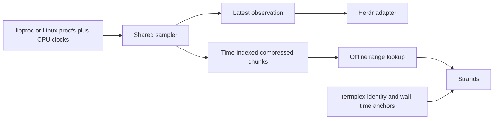

# Independent process history

Status: exploration, not a fixed format or implementation commitment.
This supersedes the capture-owned helper direction in
[`PROCSTATS_CAPTURE_PLAN.md`](PROCSTATS_CAPTURE_PLAN.md). No change to the current
plugin's restart behavior is proposed.

Storage gate: roughly **10 MB/day encoded, ideally 1 MB/day compressed**.
The initial snapshot results below do not meet it. Updated sparse/adaptive,
precision and churn experiments are in [`RECORDING_RESULTS.md`](RECORDING_RESULTS.md);
**the live storage gate remains unmet**. These are offline experiments, not a
new daemon or an enabled recording path.

## Boundary

One host-scoped observer acquires process metrics once and owns its recordings.
Herdr presents live views; termplex supplies capture identity/time correlation;
Strands reads process recordings as an independent source. No per-capture sampler
or duplicated process sidecars. Start unprivileged: coverage is everything the
observer can read, not a promise of complete cross-user visibility.



Recording and lookup do not depend on a running Herdr or termplex process.
Consumer disconnects must not stop the sampler. Terminal recording must not wait
for telemetry. Filesystem history remains a separate future source.

## Existing code worth extracting

In `src/main.rs`:

- `Process` / `identity()` (around line 53): PID, PPID, start identity, name,
  cumulative user/system CPU ns, RSS bytes.
- `ProcessSampler` / `MacProcessSampler` (around lines 770–945): native acquisition.
- Benchmark (around line 2394): before/after identity validation around metric reads.
- Lifecycle helpers (around lines 1872–2327): private control socket, singleton
  lock, status and signal handling. Their Herdr-derived paths must go away.

Do not move pane ownership, CPU bars, tree layout, metadata TTLs, plugin polling,
Herdr subscriptions or reconnect handling into the recorder. Percentages are
reader-derived; the archive preserves cumulative-counter semantics. A native
baseline plus integer CPU deltas is equivalent and need not repeat large totals.
Precision reduction is optional: exact native deltas preserve every retained
counter; coarse cumulative quotients plus endpoint remainders preserve exact
chunk endpoint totals, not every intermediate interval.

The existing native structs already expose additional fields such as virtual
size and thread count, but these need semantics/availability checks before
becoming supported archive fields. Full argv/environment collection is not a
baseline requirement and can leak secrets.

## Procfs versus native structs

Procfs is Linux-specific, not a POSIX process-stat interface. macOS already uses
`proc_listpids` and `proc_pidinfo` through `libproc`.

On Linux, begin with lightly parsed `/proc/<pid>/stat`: PID, PPID, process group,
SID, start ticks, CPU ticks, RSS pages and a short name. CPU fields use
`sysconf(_SC_CLK_TCK)`, commonly 100 ticks/s (10 ms/exported tick), not `CONFIG_HZ`.
For finer total CPU, evaluate `clock_getcpuclockid(pid)` + `clock_gettime`: Linux
exposes process/thread-group scheduler runtime in ns without that procfs tick
quantization. Query `clock_getres`; advertised resolution is not measurement
accuracy. This high-resolution path has not yet been measured or implemented here.
macOS task total-user/system fields use native Mach time units; retain their sum
in native counts with the `mach_timebase_info` rational conversion in the header.
Keep CPU and elapsed-time units explicit; convert at query time rather than
needlessly inflating native CPU increments. RSS pages use page size. Test names
containing spaces/parentheses. Do not recursively archive `/proc`: mappings,
argv, environment, descriptors and other files have very different cost/privacy
properties. Optional metrics such as `/proc/<pid>/io` are separate reads.

Use a small common row plus platform-specific optional fields, not a universal
procfs emulation. Actual machine CPU/memory pressure needs host-level counters;
summed process RSS is not unique physical memory, and process counters do not
capture every kind of machine activity.

## Smallest candidate archive

The original baseline was **full flat snapshots plus compression**, without custom
tree patching. The newer CPU-only matrix in `RECORDING_RESULTS.md` favors delta
columns over cumulative values and interleaved pairs, but does not meet the gate.
Next compare a shared observation clock/coverage plane with CPU columns and
separate topology events; nominal period changes need actual timing corrections.
This is not a selected production wire format. A tree is derived from observed
parent relationships; it need not be serialized recursively.

```text
recording header: version, host/boot, recorder run, clock identities, units
chunk:           complete sample frames, independently compressed
sample:          sequence, wall time, monotonic scan start/end, quality
rows:            [pid, start, ppid, name, user_counter, system_counter, rss, ...]
index entry:     chunk locator, sequence range, monotonic range, wall bounds
```

A later small optimization is a chunk-local process dictionary, metadata upserts
and parallel metric arrays keyed by dictionary slots. Every chunk starts with a
complete baseline; no replay from the beginning of the recording and no
cross-chunk delta dependencies. Missing slots mean unobserved, not confirmed exit.

A rebuildable flat index and CLI/library time-range lookup are enough initially;
no database or historical-query daemon is required. Bound compressed chunk size
and decoded size. Range readers select candidate chunks and filter exact sample
timestamps. Wall-clock steps can overlap chunk time bounds: do not assume wall
ranges are ordered/non-overlapping. Preserve acquisition order using sequence
and monotonic time. Point lookup returns observed time/scan bounds and distance,
not invented interpolation. CPU rates use monotonic elapsed time.

Finalize immutable chunks atomically before indexing them. Bound the active raw
tail and compression backlog; retain a readable active tail or explicitly report
that live lookup ends at the last finalized chunk. Ignore incomplete temporary
chunks on recovery; rebuild missing index entries from published chunks. Rotate
larger retention segments so short compression chunks do not imply millions of
permanent files. Chunk duration, segment size and codec remain measured choices.

## Observation quality is part of the data

The current UI sampler is not yet a trustworthy archive acquisition contract:

- Normal sampling reads BSD identity then task metrics without rechecking identity.
  Reuse the benchmark's bracketing checks to reduce PID-reuse mixing.
- Read failures silently omit a process; PID enumeration failure can return an
  empty list. Distinguish enumeration failure, unavailable metrics and a process
  no longer observed. None is an exact exit timestamp.
- A scan is not atomic. Record scan bounds/completeness and reject raced reads;
  observed PPID is not proof of a continuous historical parent relationship.
  For precise utilization, bracket each CPU read with monotonic readings (or
  record per-process offsets/uncertainty against the shared scan clock). Frame
  timestamps alone can misstate per-process elapsed time on long scans.
  Specify whether the elapsed clock includes suspend. Cumulative CPU totals do
  not recover final execution after a last successful read or unseen short lives.
- Identity must include boot scope and process start, not PID alone. Linux PID
  namespace scope also matters if namespace support is added.
- Record wall/monotonic anchors per observation or periodically with bounded
  uncertainty. Never derive all wall times from one start epoch across clock steps.
- Persist gaps and availability, not fabricated zero CPU/RSS. Polling can miss
  processes that live entirely between scans.

Use private files/socket permissions. Bound retention by bytes and age. Slow
compression or a full disk must not produce an unbounded queue; expose recorder
health and preserve interruption information when writing becomes possible again.

## Initial macOS experiment (2026-10-06)

Thirty samples at 1 Hz, 1,021–1,024 readable processes, using the existing sampler
without argv reads. Mean scan: **3.33 ms**, max **5.91 ms**. Mean tuple JSON encoding:
**0.33 ms**. Total uncompressed snapshots: **2,396,748 bytes**.

Independent chunk compression, projected storage at 1 Hz:

| Layout | Samples/chunk | zstd-1 | zstd-3 | Brotli-4 |
| --- | ---: | ---: | ---: | ---: |
| Full tuples | 1 | 2,687 MiB/day | 2,663 MiB/day | 2,581 MiB/day |
| Full tuples | 10 | 512 MiB/day | 518 MiB/day | 536 MiB/day |
| Dictionary + arrays | 10 | 485 MiB/day | 524 MiB/day | 521 MiB/day |
| Full tuples | 30 | 387 MiB/day | 372 MiB/day | 389 MiB/day |
| Dictionary + arrays | 30 | 314 MiB/day | 360 MiB/day | 363 MiB/day |

Ten-sample full tuples + zstd-1 compressed **12.85x**. Dictionary/array formatting
halved raw size but saved only **5.3%** compressed at that chunk size; at 30 samples
it saved **18.7%** with zstd-1. Larger compression windows are the first useful
lever, not elaborate tree diffs. No codec winner is established by one short run.

These are a small local workload and extrapolations, not sustained-load results.
The probe uses the current sampler's incomplete/racy semantics. It does not
measure durable I/O, per-process quality tracking, peak memory, Linux, heavy
process churn, FD inventories, or optimized-layout serialization overhead.
Every compressed payload was decompressed and checked byte-for-byte.

Repeat with the diagnostic-only probe (Cargo cache, zstd and brotli required):

```sh
python3 ~/.vim/herdr-plugins/pane-load/recording-probe.py --samples 30 --interval 1
```

It compiles the current sampler in a private temporary crate, avoids Herdr APIs,
and deletes raw process data on normal exit and catchable SIGINT/SIGTERM. SIGKILL
or a machine crash can leave private temporary files. It reports observed cadence
and scan deadline overruns, separating requested-rate from observed-rate storage
projections. It adds no dependencies to the plugin.

## First tracer bullet

1. Extract native acquisition into the independent project's small sampling module;
   preserve current Herdr behavior while fixing recording-quality reads separately.
2. Tests first: frames round-trip, PID reuse/read failure, clock steps, independent
   chunk decode and bounded transition retention. Compare sparse/predictive
   representations and explicit precision choices before choosing an archive.
   Add foreground `record` and offline range lookup only after the storage gate.
3. Measure a longer workload with fork/exec churn and sustained pressure, including
   disk growth, compression backlog, query latency and memory. Select cadence,
   chunk size, codec and retention from that evidence.
4. Add a Linux stat backend with parser fixtures, then native process lifecycle
   packaging and a narrow latest-snapshot consumer interface. OS service managers
   can supervise a foreground daemon; custom detachment is optional.
5. Connect Herdr to the shared observations and add the independent Strands source.
   Correlate with termplex's wall-time work when ready; legacy capture removal is
   not a prerequisite for this recorder.
