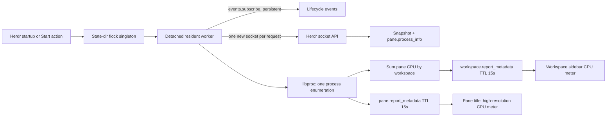

# Herdr Pane Load

`local.pane-load` is a macOS-only, resident Herdr plugin. One worker is shared per
Herdr server socket. It samples process CPU through macOS `libproc`, then reports
a short-lived pane title plus `$cpu` and `$cpu_tree` pane tokens. The same sample
is summed across every pane in each workspace and published as a workspace
`$cpu` meter for the sidebar.



## Install, link, and start

From this checkout, link the tracked plugin (or use the root bootstrap, which
links every tracked local plugin):

```bash
herdr plugin link ~/.vim/herdr-plugins/pane-load
# or: make -C ~/.vim bootstrap-herdr
herdr plugin action invoke local.pane-load.start
```

Linking and enabling do **not** start it. The manifest startup hook starts it on
a Herdr server start or live handoff. The explicit action is useful immediately
after linking or when checking a setup. Stop it with:

```bash
herdr plugin action invoke local.pane-load.stop
```

The worker also checks `plugin.list` periodically and exits when this plugin is
disabled or unlinked. Its lock, status file, and log are under
`HERDR_PLUGIN_STATE_DIR`; the private control socket uses a hashed path in `/tmp`
to stay within Unix socket path limits. No runtime files live in this source tree.
A broken server connection triggers bounded reconnect attempts, then exit; a
subsequent server startup launches a new worker. Hooks do not supervise crashes.

## Pane and workspace chrome

The sampler **owns the metadata pane title** for every pane, including ordinary
shells. It contains the numeric CPU percentage, an unbounded bar, and the compact
process topology separated by whitespace rather than a divider. Pane meters use
24 cells per 100% (about 0.52% per fractional eighth), with six-cell
25% sections separated by thin `▉` internal ticks and salient `▋` internal
hundred ticks. Exact endpoints remain full blocks. The percentage comes first so
Herdr's 80-character title limit only truncates the bar tail.

The aggregate workspace meter uses a compact six cells per 100% (about 2.08%
per fractional eighth), omits quarter ticks, and uses a thin `▉` internal hundred
tick. The dotfiles config renders it in each expanded workspace sidebar row and
colors the complete meter as a heat scale: idle gray, 1–24% blue, 25–99% green,
100–199% yellow, 200–399% peach, and 400%+ red. Mutually exclusive metadata
tokens implement the styles while the unstyled workspace `$cpu` token remains
available to API consumers. Herdr 0.9 does not expose metadata-title styling, so
pane meters retain the normal pane-border title color rather than embedding ANSI
control sequences.

Process topology also remains independently available in the pane `$cpu_tree`
token; CPU/tree rows remain absent from the Agent sidebar.

Pi's `session-topic` extension publishes its `$topic` and other sidebar tokens
but never sets or clears the Herdr pane title. There is no shared title composer
or controller coordination. Pi session names and terminal OSC titles are
independent and unchanged; semantic agent state is also untouched.

After updating, run `/reload` in each existing Pi session once it is idle so
its old title-writing extension is replaced. Other third-party metadata-title
writers must likewise be disabled; this plugin does not arbitrate with them.
The `$cpu` and `$cpu_tree` tokens remain available through `herdr pane get <id>`.

The pane `$cpu` token remains numeric for machine use; the workspace `$cpu` token
contains the bar and percentage for direct sidebar rendering. Process labels prefer
the basename of native macOS `argv[0]` when available (for example `pi` instead of
its `node` executable name), then fall back to the libproc process name. The
`term-capture` wrapper is always shown as `tcap` because its spoofed `argv[0]` is
reserved for Herdr agent binding rather than process identification. Workspace
totals include panes in every tab, not only the active tab. `$cpu` is the numeric sum of live
processes below each pane's shell root. CPU is the delta of each process's own
user+system counters divided by wall time: 100 means one core, so multi-core
work can exceed 100%. Counters from waited-for children are not aggregated.
The first sample is 0; totals and per-process values are rounded to 1%, with no
hysteresis. Main-branch selection follows the current sample. Names and commands
are refreshed on every native enumeration. Mach ticks are converted using the machine's timebase
(essential on Apple Silicon). Processes that exit between polls, cannot be read,
or detach/reparent away from the pane are not accounted for.

`$cpu_tree` uses stable small per-pane process IDs, keeps an idle main chain,
and includes hot branches at 5% or more where the 80-character token permits.
Entries use `id:name[:cpu]` (zero per-process CPU is omitted), with parentheses
and commas for edges. The tree is intentionally lossy under that bound: it
omits complete branches/edges with `...` rather than ambiguous partial entries.
Metadata uses a 15-second TTL, samples at 1Hz, and suppresses unchanged reports
except for a 5-second heartbeat. This first version uses macOS `libproc` only;
it does not use tmux, `ps`, or another CLI sampler.

Verified against Herdr 0.9.0's [plugin contract](https://raw.githubusercontent.com/herdrdev/herdr/v0.9.0/docs/next/website/src/content/docs/plugins.mdx),
[socket API](https://raw.githubusercontent.com/herdrdev/herdr/v0.9.0/docs/next/website/src/content/docs/socket-api.mdx),
and the installed `herdr api schema --json`.
Requests use one fresh Unix socket connection each; only the event subscription
stays open. The API and plugin source are local to the running Herdr server.

## Test

```bash
make -C ~/.vim/herdr-plugins/pane-load test
# With the plugin running inside Herdr: creates/closes only its own test workspace.
make -C ~/.vim/herdr-plugins/pane-load smoke
```

The old zsh PID-title hooks have been removed; existing shells keep their already
loaded hooks until restarted. To remove just those hooks in an existing shell:

```zsh
add-zsh-hook -d precmd __herdr_report_shell_process_title
add-zsh-hook -d preexec __herdr_clear_shell_process_title_for_pi
```

No tmux integration, third-party Python dependencies, or Linux backend is included.
