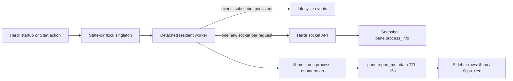

# Herdr Pane Load

`local.pane-load` is a macOS-only, resident Herdr plugin. One worker is shared per
Herdr server socket. It samples process CPU through macOS `libproc`, then reports
short-lived `$cpu` and `$cpu_tree` pane tokens.



## Install, link, and start

From this checkout, link the tracked plugin (or use the root bootstrap, which
links every tracked local plugin):

```bash
herdr plugin link ~/.vim/herdr-plugins/pane-load
# or: make -C ~/.vim bootstrap-herdr
herdr plugin action invoke local.pane-load.start
```

Linking and enabling do **not** start it. The manifest startup hook starts it on
a Herdr server start or live handoff. The explicit action is useful immediately
after linking or when checking a setup. Stop it with:

```bash
herdr plugin action invoke local.pane-load.stop
```

The worker also checks `plugin.list` periodically and exits when this plugin is
disabled or unlinked. Its lock, status file, and log are under
`HERDR_PLUGIN_STATE_DIR`; the private control socket uses a hashed path in `/tmp`
to stay within Unix socket path limits. No runtime files live in this source tree.
A broken server connection triggers bounded reconnect attempts, then exit; a
subsequent server startup launches a new worker. Hooks do not supervise crashes.

## Sidebar rows

The dotfiles config adds this row to both the default and Pi agent layouts:

```toml
["$cpu", "$cpu_tree"],
```

Values are visible in the **Agent sidebar**, not arbitrary pane-border templates.
The sampler never overrides agent titles or lifecycle state.

No config edit is required for the plugin itself. `$cpu` is the numeric sum of live
processes below each pane's shell root. CPU is the delta of each process's own
user+system counters divided by wall time: 100 means one core, so multi-core
work can exceed 100%. Counters from waited-for children are not aggregated.
The first sample is 0; values are rounded to 5%. Names are refreshed on every
native enumeration. Mach ticks are converted using the machine's timebase
(essential on Apple Silicon). Processes that exit between polls, cannot be read,
or detach/reparent away from the pane are not accounted for.

`$cpu_tree` uses stable small per-pane process IDs, keeps an idle main chain,
and includes hot branches at 5% or more where the 80-character token permits.
Entries use `id:name[:cpu]` (zero per-process CPU is omitted), with parentheses
and commas for edges. The tree is intentionally lossy under that bound: it
omits complete branches/edges with `...` rather than ambiguous partial entries.
Metadata uses a 15-second TTL, samples at 1Hz, and suppresses unchanged reports
except for a 5-second heartbeat. This first version uses macOS `libproc` only;
it does not use tmux, `ps`, or another CLI sampler.

Verified against Herdr 0.9.0's [plugin contract](https://raw.githubusercontent.com/herdrdev/herdr/v0.9.0/docs/next/website/src/content/docs/plugins.mdx),
[socket API](https://raw.githubusercontent.com/herdrdev/herdr/v0.9.0/docs/next/website/src/content/docs/socket-api.mdx),
and the installed `herdr api schema --json`.
Requests use one fresh Unix socket connection each; only the event subscription
stays open. The API and plugin source are local to the running Herdr server.

## Test

```bash
make -C ~/.vim/herdr-plugins/pane-load test
# With the plugin running inside Herdr: creates/closes only its own test pane.
make -C ~/.vim/herdr-plugins/pane-load smoke
```

The old zsh PID-title hooks have been removed; existing shells keep their already
loaded hooks until restarted. To remove just those hooks in an existing shell:

```zsh
add-zsh-hook -d precmd __herdr_report_shell_process_title
add-zsh-hook -d preexec __herdr_clear_shell_process_title_for_pi
```

No tmux integration, third-party Python dependencies, or Linux backend is included.
