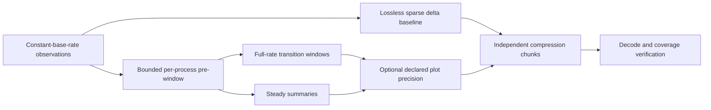

# Process-history recording experiments

Measured 2026-10-08; summarized 2026-10-09. Experimental Python codecs/policies
around the existing Rust/macOS acquisition code. **Production `src/main.rs`,
Herdr reporting, plugin configuration and startup behavior are unchanged.**

## Storage gate

Aim for roughly **10 MB/day encoded and ideally 1 MB/day compressed**, with
constant-base-rate observation and higher retained detail around important
transitions. Neither the live storage gate nor a production recording format has
been established. Synthetic compressibility is not evidence that this host meets
the gate. There is no background recording service installed by these experiments.



Observation and retention are separate. Detection uses the original observations,
not rounded archive values. Adaptive summaries are intentionally lossy outside
transition windows. Precision variants declare units and their error bounds.

## Same-capture live comparison

600 samples at a requested 10 Hz, roughly one minute, 1,007–1,168 readable
processes. One controlled worker: 30-second CPU plateau, return to quiet,
one-second CPU pulse, and a 20 MiB RSS allocation ramp. Lower-rate experiments
subsample the same capture; they are not separate acquisition measurements.

60-second independently decodable chunks; projected daily figures below repeat
this short workload and its checkpoint overhead. **Not an observed daily total.**
All compression/layout variants are checked after decompression.

| Encoding | Encoded MiB/day | Compressed MiB/day (Brotli-4) |
| --- | ---: | ---: |
| Full tuple snapshots | 67,081 | 1,854 |
| Lossless sparse masks + varints | 1,271 | 1,019 |
| Sparse with bounded plot precision | 615 | **246** |
| Adaptive windows + sparse selected samples | 1,372 | 602 |
| Adaptive + bounded plot precision | 1,279 | 379 |

The 246 MiB/day variant also measured 247 MiB/day with zstd-3. No useful codec
winner is established here: representation and retention dominate that difference.

Plot-precision variant:

- cumulative CPU counters floored to 1 ms (counter error less than 1 ms);
- RSS floored to 64 KiB (error less than 64 KiB);
- wall/start timestamps floored to 1 ms, scan-end timestamps rounded upward;
  scan envelopes remain conservative;
- adaptive steady summaries, where used: 60-second maximum span, CPU endpoints
  at 10 ms precision, RSS endpoints at 256 KiB with outward-rounded RSS extrema.

These are explicitly bounded approximations, not exact counters/timestamps.
PID/start identity is never rounded. Default lossless variants preserve every
integer. The precision policy is an experiment, not a recommended final setting.

Native scan averaged **8.78 ms**, max **405.76 ms**; tuple encoding averaged
**0.50 ms**. There were **25 scan deadline overruns**. The collector catches up
on its nominal schedule: averaged 10 Hz is not a guarantee of evenly spaced or
exhaustive observations. Historical truth must include scan bounds, availability
and acquisition gaps. Unreadable/raced reads remain missing observations, not exits.

## What is costing space?

This was not a quiet topology: **4,816 distinct PIDs**, including **3,770 first
observed after the initial frame**, within one minute. None changed its start
identity in this capture. Of those new PIDs, 1,662 were `sleep` and 1,005 `bash`:
roughly 71% of observed new processes came from those two names.

Lossless sparse raw-byte breakdown for that minute:

| Contributor | Bytes | Approximate share |
| --- | ---: | ---: |
| User + system CPU increments | 526,452 | 57% |
| Slot identifiers + field masks | 193,301 | 21% |
| New identities + initial values | 155,212 | 17% |
| RSS changes | 40,982 | 4% |
| Timing + record counts | 8,971 | 1% |
| Name / existing-parent changes | 925 | <1% |

There were about 142 user-counter and 143 system-counter changes per base tick;
RSS changed for about 22 processes per tick. Compression operates on all of these
contributors together, so these shares are not compressed-byte attribution.

**Static tree serialization is not the primary remaining problem.** New-process
churn still matters, but tiny, frequent cumulative-counter changes dominate the
raw delta stream. The first adaptive policy also reopened windows repeatedly as
CPU rates fluctuated; adaptive encoding was not automatically smaller than the
lossless baseline. Startup windows and per-process summary overhead are additional
costs, not yet optimized away.

## Synthetic control

A deliberately simple 1,000-process mostly-idle host with only a few active
processes and predictable timestamps reached **1.70 MiB/day compressed at 10 Hz**
using lossless sparse varints and zstd-1 (45.81 MiB/day encoded). The 1 Hz version
was 1.72 MiB/day compressed. This demonstrates that unchanged processes need not
multiply storage with sample frequency.

It has highly repetitive names, start metadata, timing and counters. The simple
adaptive policy/encoding was worse, around 10–12 MiB/day compressed after sparse
sample packing. Neither result represents realistic whole-machine performance.

## CPU/time columns and accounting-preserving retention

Measured 2026-10-09 against the **same** private one-minute capture. New offline
`recording_cpu_columns.py` / `recording_cpu_matrix.py` experiments; no production
changes. This isolates **CPU/time series only**, excluding PID/start/name/parent,
RSS, availability events, wall-clock correlation and seek indexes. Even these
component projections remain far above the storage gate.

```text
native cumulative CPU C[i]          observed monotonic time T[i]
           |                                   |
     retain first/last + selected grid points (all observed identities kept)
           |                                   |
     cumulative quotient/remainder, NOT rounded individual intervals
           |                                   |
     CPU delta column                   actual elapsed-time column
           +----------------------+----------------+
                                  |
                    independent per-series baseline + endpoint remainders
                                  |
                         compressor -> decode -> accounting checks
```

The input normalized user/system counters are individually restored to native
Mach counts with an explicitly supplied **125/3 ns** timebase. Every restored
counter is checked by converting back to the captured integer. Their **native
sum** is used as total CPU; no separate user/system arrays in this experiment.
Native tick counts, not decimal nanosecond representations, are the lossless
baseline. This timebase is machine-specific, not a universal macOS constant.

For a CPU quantum `Q`, store `q[i] = C[i] // Q`, then differences of `q[i]`.
Preserve first/final remainders `r[i] = C[i] % Q`:

```text
Q * sum(delta_q) + r_final - r_first = C_final - C_first
C_first = Q * q_first + r_first
C_final = Q * q_final + r_final
```

Raw-native mode preserves every retained CPU counter exactly. Coarse modes have
intermediate counter error **less than Q**, but exact first/final counter values
and exact observed CPU increments. Endpoint corrections do **not** make every
intermediate interval exact. Rounding each CPU increment independently would
lose repeated sub-quantum usage and is deliberately not used. Time is similarly
quantized cumulatively to 1 ms, with exact endpoint time remainders.

Both 1 Hz and 10 Hz **retention** keep every observed process identity, including
single-observation identities, and first/last available readings. All variants
with endpoint corrections preserve the same **6,671,219,228 native CPU ticks**
(~277.967 CPU-seconds) of observed first-to-last increments. This excludes CPU
before each first read from the increment sum (its cumulative baseline is still
saved), and cannot recover unobserved exit tails or never-observed processes.
The 1 Hz mode is not an acquisition-at-1-Hz experiment: short-life endpoints may
still be 100 ms apart. No process churn is silently removed to improve storage.

Projection duration is **59.904674875 s**, measured first-to-last scan start;
this convention differs slightly from earlier nominal-one-minute projections.
The capture has frame scan-start/end markers, **not per-process read timestamps**:
encoding-time error bounds do not imply corresponding utilization accuracy.
Batch scan skew and kernel accounting uncertainty remain separate limitations.

### Compressor/layout matrix

96 binary variants: eight layouts x uvarints/fixed-u64 x three CPU precisions x
two retention rates. Each is evaluated with zstd-1, zstd-3, Brotli-4 and gzip-6
(**384 compression cases**); exact decompression, cumulative arrays and endpoint
accounting are independently checked. Validation also works under `python -O`.

Best compressed result per layout, **1 ms CPU point precision**, including exact
CPU/time endpoint remainders; MiB/day projections, **not measured daily totals**:

| Layout | 1 Hz retained | 10 Hz retained |
| --- | ---: | ---: |
| Cumulative CPU + elapsed time, interleaved | 173.05 | 600.29 |
| Cumulative CPU column + elapsed-time column | 105.03 | 185.16 |
| CPU/time deltas, interleaved | 92.67 | 155.51 |
| **CPU/time delta columns** | **80.22** | **123.26** |
| CPU delta column + period-change runs | 83.67 | 144.20 |
| CPU delta column + period-grouped start-index lists | 83.92 | 143.02 |
| CPU/time both run-coded | 95.02 | 190.00 |
| CPU run-coded + elapsed-time column | 91.85 | 168.83 |

Winning layout at every tested precision was plain delta columns with uvarints:

| CPU point precision | Encoded MiB/day, 1 Hz | Compressed MiB/day, 1 Hz | Encoded MiB/day, 10 Hz | Compressed MiB/day, 10 Hz |
| --- | ---: | ---: | ---: | ---: |
| Raw native tick (~41.7 ns/unit) | 443.66 | 123.39 | 2034.93 | 358.18 |
| 1 ms + exact endpoint remainders | 410.90 | 80.22 | 1886.93 | 123.26 |
| 10 ms + exact endpoint remainders | 416.62 | 68.18 | 1893.15 | 92.29 |

The 1 Hz column winners used gzip-6. At 10 Hz, raw-native and 10 ms used Brotli-4;
1 ms used gzip-6. Coarsening points is not guaranteed to reduce **encoded** bytes:
larger exact remainders can outweigh smaller deltas. Run coding reduced some raw
sizes but compressed worse; optimize the whole pipeline, not only precompression.

Column ordering helps. Period-change indexes did **not** win on this live input:
actual elapsed intervals vary with scheduler/scan jitter even at fixed nominal
cadence. A frequency policy is not an exact elapsed-time clock. A future shared
clock experiment should separate nominal period changes from actual timing
corrections rather than silently replacing observations with scheduled times.

Reproduce (raw capture remains private; only summary results belong in Git):

```sh
python3 recording_cpu_matrix.py --input /path/to/private/capture.jsonl \
  --mach-timebase 125 3 --rates 1 10 --cpu-ms 0 1 10 --time-ms 1
```

Without `--mach-timebase`, captured CPU ns integers are treated as the counter
units instead. Exact inverse restoration rejects noninjective timebases. Coarse
time units that collapse distinct retained points are explicitly rejected.
`--endpoints bounded` deliberately omits endpoint corrections and is **not** an
exact native CPU-total representation; it must not be compared as equal fidelity.

### Acquisition parameters for the next backend experiment

- Linux `/proc/<pid>/stat` fields 14/15 export user/system in
  `sysconf(_SC_CLK_TCK)` ticks; commonly 100 Hz means 10 ms per tick. This is not
  `CONFIG_HZ` and not proof of 10 ms internal accounting. Children are separate;
  process-wide totals should not be added again to their per-thread totals.
- **Linux need not use that coarse export for total CPU.**
  [`clock_getcpuclockid(pid, &id)` followed by `clock_gettime(id, &ts)`](https://man7.org/linux/man-pages/man3/clock_getcpuclockid.3.html)
  exposes a process CPU-time clock in seconds/nanoseconds. Linux's scheduler CPU
  clock is process/thread-group runtime, not `/proc` USER_HZ ticks. Query
  `clock_getres`; nanosecond units/advertised resolution are not nanosecond
  measurement accuracy. Use `/proc` for identity/topology/RSS, and benchmark the
  additional CPU-clock path on Linux before adopting it (no Linux backend added).
- macOS existing `proc_listpids` + `proc_pidinfo(PROC_PIDTASKINFO)` provides
  `pti_total_user` and `pti_total_system` in Mach absolute-time units. Query
  `mach_timebase_info`, don't assume ns. Apple's
  [`fill_taskprocinfo`](https://github.com/apple-oss-distributions/xnu/blob/main/osfmk/kern/bsd_kern.c)
  uses `recount_task_times`; live-thread values subtract terminated-thread time
  from those totals, so **total** values retain terminated-thread CPU.
- A separate C diagnostic on this Apple Silicon host verified the 125/3 timebase:
  4,736,913 native CPU ticks became 197,371,375 ns, versus 197,374,000 ns from
  `getrusage`, during a 200 ms wall-time burn. The few microseconds of difference
  include the differing read boundaries; this checks units, not nanosecond accuracy.
- Proposed acquisition should bracket each CPU read with actual monotonic clock
  readings; never compute utilization from the requested sampling period alone.
  Record clock basis/suspend semantics, uncertainty and missing observations.
  Native CPU units and time units are separate chunk-header parameters.

Next useful format experiment: **shared observation clock / coverage plane**, CPU
columns and per-series baselines, sparse nonzero CPU positions or runs selected by
measured cost, separate topology events. Preserve exact native deltas unless
coarser point precision and endpoint-only exactness are explicitly chosen. This
matrix does not establish a final format, full-machine budget, or adaptive policy.

## Verification and limits

- `make test`: 33 existing Rust tests, 52 experimental Python tests, fmt/clippy.
  The existing wall-time-bounded busy-self test failed once while compression ran
  concurrently; isolated/full serial reruns passed. Its contention sensitivity
  was not addressed by changing production code or weakening the test.
- New CPU column/matrix tests also pass with `python -O`: accounting validation
  is explicit, not stripped-out assertions. Grouped singleton series, component
  resets hidden by total growth, size limits and malformed run/index data are covered.
- Exact sparse round-trips, independent chunks, PID reuse, missing/reappearing
  observations, metadata/counter changes, wall steps and malformed data.
- Full-rate two-second pre/post windows at both ends of a sustained plateau,
  one-sample pulses, slow RSS ramps, neighbor isolation and complete coverage.
- Rational threshold comparisons, strictly increasing acquisition time/sequence,
  explicit per-process buffer cap; emitted full samples leave the ring.
- Summaries split at compression boundaries using original observations. Exact
  per-identity chunk coverage is tested. Packing is offline, not live publication.
- Precision error bounds, unchanged identities, conservative scan envelopes,
  effective-unit reporting, private exclusive capture creation and replay.
- Manual SIGTERM smoke: native sampler and controlled workload both reaped;
  private temporary raw files removed.

The replay harness holds a capture/results in memory to compare encodings; only
its adaptive policy is streaming/bounded. This is not a measured low-memory
production implementation. Index/file-system/retention overhead, Linux and
long-duration behavior remain unmeasured. Polling can miss entire short lifetimes.

## Repeat

```sh
# Defaults: private temporary raw data, constant nominal 10 Hz, 60-second run.
python3 recording_experiment.py --workload --rates 10 --summary-seconds 60 \
  --summary-cpu-ms 10 --summary-rss-kib 256 \
  --precision-cpu-ms 1 --precision-rss-kib 64 --precision-time-us 1000

# Deterministic control, no native acquisition or workload process.
python3 recording_experiment.py --synthetic --seconds 60 --hz 10
```

Run from this directory; live acquisition requires macOS, cached Cargo dependencies,
zstd and brotli. `--capture-out PATH` explicitly preserves a new mode-0600 diagnostic
capture; it refuses overwrites. `--input PATH` replays it without sampling or
launching the workload. Delete explicitly retained captures when no longer needed.

## Next narrow experiments

1. Measure CPU counter precision / predictive counter coding separately on the
   same captured input; do not combine every representation choice at once.
2. Reduce startup and stable-summary overhead; avoid dense retention merely
   because an already-running process is first observed.
3. Test compact short-lifetime records and recurring low-cost process patterns,
   keeping full identities in the retrospective ring so significant changes can
   retain their surrounding detail. Any grouped archive must state what it omits.
4. Separate checkpoint cadence from compression-frame cadence and measure longer
   runs; one-minute startup/checkpoint extrapolation cannot establish a daily budget.

No daemonization or Herdr integration work is justified by the storage results yet.
