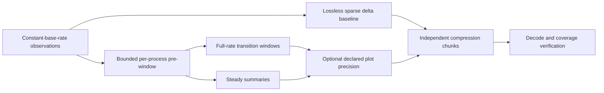

# Process-history recording experiments

Measured 2026-10-08; summarized 2026-10-09. Experimental Python codecs/policies
around the existing Rust/macOS acquisition code. **Production `src/main.rs`,
Herdr reporting, plugin configuration and startup behavior are unchanged.**

## Storage gate

Aim for roughly **10 MB/day encoded and ideally 1 MB/day compressed**, with
constant-base-rate observation and higher retained detail around important
transitions. Neither the live storage gate nor a production recording format has
been established. Synthetic compressibility is not evidence that this host meets
the gate. There is no background recording service installed by these experiments.



Observation and retention are separate. Detection uses the original observations,
not rounded archive values. Adaptive summaries are intentionally lossy outside
transition windows. Precision variants declare units and their error bounds.

## Same-capture live comparison

600 samples at a requested 10 Hz, roughly one minute, 1,007–1,168 readable
processes. One controlled worker: 30-second CPU plateau, return to quiet,
one-second CPU pulse, and a 20 MiB RSS allocation ramp. Lower-rate experiments
subsample the same capture; they are not separate acquisition measurements.

60-second independently decodable chunks; projected daily figures below repeat
this short workload and its checkpoint overhead. **Not an observed daily total.**
All compression/layout variants are checked after decompression.

| Encoding | Encoded MiB/day | Compressed MiB/day (Brotli-4) |
| --- | ---: | ---: |
| Full tuple snapshots | 67,081 | 1,854 |
| Lossless sparse masks + varints | 1,271 | 1,019 |
| Sparse with bounded plot precision | 615 | **246** |
| Adaptive windows + sparse selected samples | 1,372 | 602 |
| Adaptive + bounded plot precision | 1,279 | 379 |

The 246 MiB/day variant also measured 247 MiB/day with zstd-3. No useful codec
winner is established here: representation and retention dominate that difference.

Plot-precision variant:

- cumulative CPU counters floored to 1 ms (counter error less than 1 ms);
- RSS floored to 64 KiB (error less than 64 KiB);
- wall/start timestamps floored to 1 ms, scan-end timestamps rounded upward;
  scan envelopes remain conservative;
- adaptive steady summaries, where used: 60-second maximum span, CPU endpoints
  at 10 ms precision, RSS endpoints at 256 KiB with outward-rounded RSS extrema.

These are explicitly bounded approximations, not exact counters/timestamps.
PID/start identity is never rounded. Default lossless variants preserve every
integer. The precision policy is an experiment, not a recommended final setting.

Native scan averaged **8.78 ms**, max **405.76 ms**; tuple encoding averaged
**0.50 ms**. There were **25 scan deadline overruns**. The collector catches up
on its nominal schedule: averaged 10 Hz is not a guarantee of evenly spaced or
exhaustive observations. Historical truth must include scan bounds, availability
and acquisition gaps. Unreadable/raced reads remain missing observations, not exits.

## What is costing space?

This was not a quiet topology: **4,816 distinct PIDs**, including **3,770 first
observed after the initial frame**, within one minute. None changed its start
identity in this capture. Of those new PIDs, 1,662 were `sleep` and 1,005 `bash`:
roughly 71% of observed new processes came from those two names.

Lossless sparse raw-byte breakdown for that minute:

| Contributor | Bytes | Approximate share |
| --- | ---: | ---: |
| User + system CPU increments | 526,452 | 57% |
| Slot identifiers + field masks | 193,301 | 21% |
| New identities + initial values | 155,212 | 17% |
| RSS changes | 40,982 | 4% |
| Timing + record counts | 8,971 | 1% |
| Name / existing-parent changes | 925 | <1% |

There were about 142 user-counter and 143 system-counter changes per base tick;
RSS changed for about 22 processes per tick. Compression operates on all of these
contributors together, so these shares are not compressed-byte attribution.

**Static tree serialization is not the primary remaining problem.** New-process
churn still matters, but tiny, frequent cumulative-counter changes dominate the
raw delta stream. The first adaptive policy also reopened windows repeatedly as
CPU rates fluctuated; adaptive encoding was not automatically smaller than the
lossless baseline. Startup windows and per-process summary overhead are additional
costs, not yet optimized away.

## Synthetic control

A deliberately simple 1,000-process mostly-idle host with only a few active
processes and predictable timestamps reached **1.70 MiB/day compressed at 10 Hz**
using lossless sparse varints and zstd-1 (45.81 MiB/day encoded). The 1 Hz version
was 1.72 MiB/day compressed. This demonstrates that unchanged processes need not
multiply storage with sample frequency.

It has highly repetitive names, start metadata, timing and counters. The simple
adaptive policy/encoding was worse, around 10–12 MiB/day compressed after sparse
sample packing. Neither result represents realistic whole-machine performance.

## Verification and limits

- `make test`: 33 existing Rust tests, 38 experimental Python tests, fmt/clippy.
- Exact sparse round-trips, independent chunks, PID reuse, missing/reappearing
  observations, metadata/counter changes, wall steps and malformed data.
- Full-rate two-second pre/post windows at both ends of a sustained plateau,
  one-sample pulses, slow RSS ramps, neighbor isolation and complete coverage.
- Rational threshold comparisons, strictly increasing acquisition time/sequence,
  explicit per-process buffer cap; emitted full samples leave the ring.
- Summaries split at compression boundaries using original observations. Exact
  per-identity chunk coverage is tested. Packing is offline, not live publication.
- Precision error bounds, unchanged identities, conservative scan envelopes,
  effective-unit reporting, private exclusive capture creation and replay.
- Manual SIGTERM smoke: native sampler and controlled workload both reaped;
  private temporary raw files removed.

The replay harness holds a capture/results in memory to compare encodings; only
its adaptive policy is streaming/bounded. This is not a measured low-memory
production implementation. Index/file-system/retention overhead, Linux and
long-duration behavior remain unmeasured. Polling can miss entire short lifetimes.

## Repeat

```sh
# Defaults: private temporary raw data, constant nominal 10 Hz, 60-second run.
python3 recording_experiment.py --workload --rates 10 --summary-seconds 60 \
  --summary-cpu-ms 10 --summary-rss-kib 256 \
  --precision-cpu-ms 1 --precision-rss-kib 64 --precision-time-us 1000

# Deterministic control, no native acquisition or workload process.
python3 recording_experiment.py --synthetic --seconds 60 --hz 10
```

Run from this directory; live acquisition requires macOS, cached Cargo dependencies,
zstd and brotli. `--capture-out PATH` explicitly preserves a new mode-0600 diagnostic
capture; it refuses overwrites. `--input PATH` replays it without sampling or
launching the workload. Delete explicitly retained captures when no longer needed.

## Next narrow experiments

1. Measure CPU counter precision / predictive counter coding separately on the
   same captured input; do not combine every representation choice at once.
2. Reduce startup and stable-summary overhead; avoid dense retention merely
   because an already-running process is first observed.
3. Test compact short-lifetime records and recurring low-cost process patterns,
   keeping full identities in the retrospective ring so significant changes can
   retain their surrounding detail. Any grouped archive must state what it omits.
4. Separate checkpoint cadence from compression-frame cadence and measure longer
   runs; one-minute startup/checkpoint extrapolation cannot establish a daily budget.

No daemonization or Herdr integration work is justified by the storage results yet.
