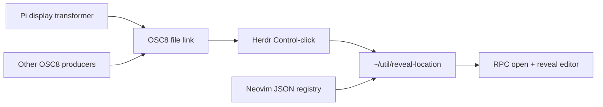

# Present-state file reveal

Control-click an OSC8 `file://` link in Herdr to navigate a suitable Neovim/Neovide. The plugin accepts links from **any** producer; it does not detect raw `src/foo.ts:42` text. No Ghostty patch or OS URL registration is needed.



## Install and use

This requires the companion `~/util/reveal-location` and the Pi extension in `~/util/pi/extensions/file-links/`.

```sh
herdr plugin link ~/.vim/herdr-plugins/reveal-location
# Or use the repository's bootstrap, once these files are tracked:
make -C ~/.vim bootstrap-herdr
```

Neovim loads `config.reveal` from `init.lua`. Existing editors can publish immediately without re-sourcing their whole config:

```vim
:lua require('config.reveal').setup()
```

Use Pi `/reload` to load the file-links extension. It transforms assistant Markdown only: existing files in inline code and conservative prose references become explicit links. Fenced code, existing links, and unresolved paths stay unchanged. Built-in Pi tool path links also work. `PI_HYPERLINKS=0` disables OSC8; unset/auto detection is supplemented inside Herdr unless Pi settings explicitly disable hyperlinks.

**Control-click**, not Ghostty-native Cmd-click, is the managed reveal gesture. Herdr supplies the URL and clicked-pane context, and invokes this plugin server-side. The helper executes on the machine where the pane's Herdr server runs. Remote-to-local editor routing is not implemented.

## Target and selection rules

- `file:///absolute/path` opens the current file; without a location, an existing cursor is preserved.
- `file:///absolute/path#L42C7` or `#L42` opens a one-based line/byte-column. This fragment is our convention, not an OS standard. Out-of-range positions are clamped by Neovim.
- Legacy local `file://HOST/path:42:7` and `path:42` arguments are supported by the helper. URI paths must be percent-encoded. Literal existing filenames win over ambiguous numeric suffixes.
- Foreign hosts, missing files, unsupported fragments, control characters, and special files are rejected. No automatic SSH or project-wide searching.
- Text/source files prefer a live editor already on the file, then the deepest matching CWD, then focus/update recency. PID and RPC identity are checked; stale candidates are skipped.
- Modified buffers are preserved. Navigation uses structured data through Neovim RPC, never shell-evaluated paths.
- Neovide uses `NeovideFocus`. Terminal editors use their registered Herdr socket/pane or tmux pane. With no suitable editor, Neovide is launched. Directories/nontext files are revealed in Finder on macOS; Linux opens the directory or the file's parent. The helper does not launch linked applications/executables via file associations.

The registry is `${XDG_STATE_HOME:-~/.local/state}/reveal-location/editors/<pid>.json`, atomically maintained by each editor. Neovide ignores inherited Herdr/tmux variables. The old `nvim-in-tmux.state` is no longer consumed. An editor with both terminal environments is treated as Herdr-hosted; nested-tmux navigation is not yet modeled. Herdr pane focus does not promise to foreground another outer-terminal window/client.

Every helper request appends a private JSONL trace to `${XDG_STATE_HOME:-~/.local/state}/reveal-location/reveal.log`: incoming target, clicked-pane identity, editor selection, action, outcome, and duration. Dry runs are marked in every record. Logging is best-effort and does not affect navigation; the log is append-only and may be cleared when desired.

Failed reveals also appear in Herdr's plugin log and request a notification. Inspect with:

```sh
herdr plugin log list --plugin local.reveal-location
tail -f ~/.local/state/reveal-location/reveal.log
~/util/reveal-location --dry-run -- 'file:///absolute/path#L42'
```

`--dry-run` may perform read-only editor probes but does not navigate, focus, or launch anything.

If Control-click produces no new helper entry and no Herdr plugin entry, dispatch never reached the helper. A URL printed in parentheses next to a styled label is Pi's **non-OSC8 fallback**, not a working OSC8 link. Reload the updated file-links extension and check again. If the log reports `launch-neovide` instead of `navigate`, no matching responsive registered editor was found; publish from the desired existing editor with the setup command above.

## Validation

`make -C ~/.vim test` tests publication, lifecycle/container precedence, adapter argv safety, and error notifications. `make -C ~/util test-reveal` includes disposable headless Neovim RPC tests. Pi's suite tests Markdown conversion and actual renderer OSC8 output.

A separate disposable Herdr session was exercised with the real Pi extension and a minimal-config Neovim: observed OSC8 → `pane.link.activate` → production plugin/helper → exact line/column → editor-pane focus. A plain shell's OSC8 `file://...#L2` also passed. No existing editor buffers were changed during the smoke test. GUI Control-click transport was previously verified in `spikes/terminal-links/`; the production smoke uses that same Herdr activation API without stealing window focus.
