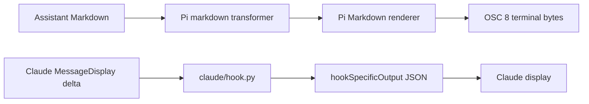

# Terminal-link spike

Small, reproducible **spike**, not production integration. It tests two display-only hooks against one deliberately fixed fixture reference:

`src/target.ts:7:3` → `file:///tmp/link-spike-20260916/project/src/target.ts#L7C3`

There is no resolver: no path lookup, ranges, escaping, workspace logic, or generalization. The Pi transformer only changes an assistant Markdown inline-code token; it does not change the session message.



## Files and tests

- `pi/extension.ts` — fixed Pi `registerMarkdownTransformer` extension.
- `pi/test-render.mjs` — standalone Pi renderer check using the installed package.
- `pi/fixture.jsonl` — original plaintext transcript fixture; tests never rewrite it.
- `claude/hook.py` — fixed JSON `MessageDisplay` hook; it emits no logs.
- `claude/mock.py` — optional localhost-only Claude Messages JSON/SSE fixture.
- `claude/settings.json` — settings fixture for a copy at the fixed `/tmp` root.
- `project/src/target.ts` — disposable file whose line 7 is the tested target.

Run deterministic tests (no model, network, or GUI calls):

```sh
cd /Users/slu/.vim/spikes/terminal-links
make test
# or: PI_PACKAGE_ROOT=/Users/slu/.n/lib/node_modules/@earendil-works/pi-coding-agent make test
```

`PI_PACKAGE_ROOT` permits another already-installed Pi package; no dependency is installed.

## Optional live reproduction

The URL is intentionally absolute and must point at the exact fixture path. The setup below refuses to touch an existing path; remove the disposable directory yourself before retrying. It does not use a random `mktemp` path because that would invalidate the fixed-path result.

```sh
cd /Users/slu/.vim/spikes/terminal-links
root=/tmp/link-spike-20260916
if test -e "$root"; then echo "refusing to overwrite existing $root" >&2; exit 1; fi
mkdir -p "$root/project/src" "$root/claude" "$root/pi"
cp project/src/target.ts "$root/project/src/target.ts"
cp claude/hook.py claude/settings.json "$root/claude/"
cp pi/extension.ts pi/fixture.jsonl "$root/pi/"
```

In a **disposable** Herdr pane, launch Pi without calling a model:

```sh
cd /tmp/link-spike-20260916/project
PI_HYPERLINKS=1 pi --session ../pi/fixture.jsonl \
  --no-extensions -e ../pi/extension.ts --no-skills \
  --no-prompt-templates --no-context-files --offline
```

The synthetic fixture model may produce a harmless fallback-model warning. Do not send a prompt: the saved assistant message suffices for this test.

Start the optional local mock (it binds only `127.0.0.1`, port 0, and prints its port):

```sh
python3 claude/mock.py              # default: final newline
python3 claude/mock.py --no-newline # variant without final newline
```

In another disposable pane, substitute the printed port (do not use real credentials):

```sh
cd /tmp/link-spike-20260916/project
port=REPLACE_WITH_PRINTED_PORT
case "$port" in ''|*[!0-9]*) echo 'set the localhost fixture port' >&2; exit 1;; esac
env -u CLAUDE_CODE_OAUTH_TOKEN -u ANTHROPIC_AUTH_TOKEN \
  ANTHROPIC_API_KEY=spike-local-only \
  ANTHROPIC_BASE_URL="http://127.0.0.1:$port" \
  CLAUDE_CODE_DISABLE_NONESSENTIAL_TRAFFIC=1 FORCE_HYPERLINK=1 \
  claude --settings ../claude/settings.json --setting-sources '' \
  --strict-mcp-config --tools '' --permission-mode dontAsk \
  --disable-slash-commands --model haiku --effort low \
  --system-prompt 'You are a local terminal rendering fixture.' \
  -- 'Print the two fixture references.'
```

Approve only the disposable directory and fake key if prompted. These approvals create entries in Claude's state file; remove only those fixture-specific entries after exiting. No login/logout is necessary. The mock never makes external requests and does not log headers, credentials, prompts, or message bodies. Stop it with Ctrl-C; clean up only resources created for the spike.

Capture `herdr terminal session observe PANE_ID` **before** the response begins; its JSON `bytes` field is base64 ANSI. `pane read --format ansi` omitted OSC8 metadata in this version, so it is not a valid hyperlink test. Compare streaming frames with a fresh observer snapshot after completion. In Claude, `HOOKED-MARKDOWN` and the two Markdown hyperlink targets appear transiently, then disappear from the final render.

A Herdr plugin's `[[link_handlers]]` can match `^file:///tmp/link-spike-20260916/project/` and log `HERDR_PLUGIN_CLICKED_URL` plus `HERDR_PLUGIN_CONTEXT_JSON`. Use a unique temporary plugin ID and unlink it afterward; plugin registration is user-global even with a named test session. `#L7C3` is our fixture convention, **not** an OS-standard line/column handler. The parent tested it with a deliberately allowlisted handler and a separate `nvim --headless -u NONE --listen ...` instance, never a user's editor.

## Conclusions from the parent run

Measured versions: Herdr 0.9.0, Pi 0.84.4, Ghostty 1.3.0-main+685daee01, Claude 2.1.273.

- Pi restored the real TUI inside Herdr and OSC 8 was observed. A real GUI Ctrl-click in unfocused `w1:p1` while `w1:p2` was focused passed the clicked-pane context (despite the field being named `focused_pane_id`), and the pane remained unfocused.
- macwin stock had no modifier click: a temporary-copy Control click via `postToPid` did not activate; a temporary global CGEvent Ctrl-click with cursor restoration worked.
- Disposable Neovim RPC resolved the fixture to file line 7, column 3.
- Claude 2.1.273 `MessageDisplay` ran and returned valid JSON. A live localhost SSE run showed transformed Markdown OSC 8 while streaming, but final redraw dropped the transformed marker and links restored the original text; this happened with and without the final newline and with `FORCE_HYPERLINK=1`.
- Injected raw OSC also had no final targets. Do not claim raw-stream support.

Both agents' saved assistant text remained unchanged. The Claude finding is a reproducible limitation in this **mocked-response test**, not proof about every provider, mode, or Claude version. The mock uses unique message IDs and deliberately splits references across SSE chunks; the hook received complete lines.

These results do not establish a full resolver, Pi model streaming behavior, or compatibility with all Claude versions. No Ghostty patch or OS URL registration was needed for the successful Pi → Herdr-Control-click → editor path. Ghostty-native Cmd-click is a different dispatch path and was not tested.

## Cleanup and retained evidence

The test Ghostty process/window, named Herdr session, temporary plugin registration, local mock server, and disposable Neovim were all removed/stopped. Only fixture-specific Claude project trust and fake-key approval were removed from its state; production configs and the installed macwin were unchanged. Original Herdr sessions `default`, `fresh`, and `fresh2` remained running.

Local evidence remains under `/tmp/link-spike-20260916/`: screenshots, observer frames, click context records, final editor state, hook logs, and disposable transcripts. Those logs are intentionally not committed. This directory is disposable but must be moved aside before repeating the fixed-path setup above.

Next decision: prototype a real contextual resolver behind Pi's display transformer and Herdr's existing click handler. Treat Claude final-display persistence as a separate reproduction/bug investigation, not something a Herdr plugin can repair by rewriting terminal cells.
